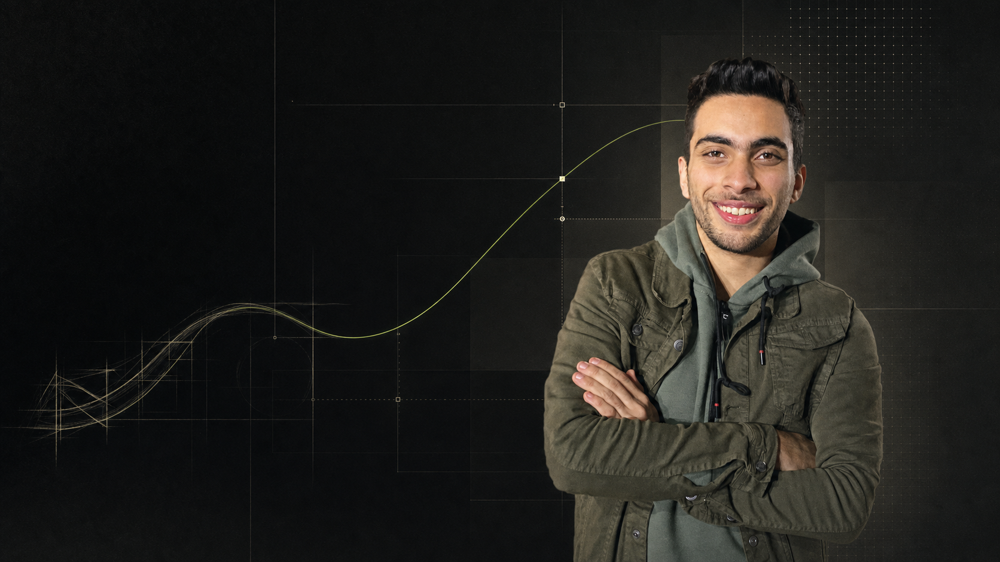
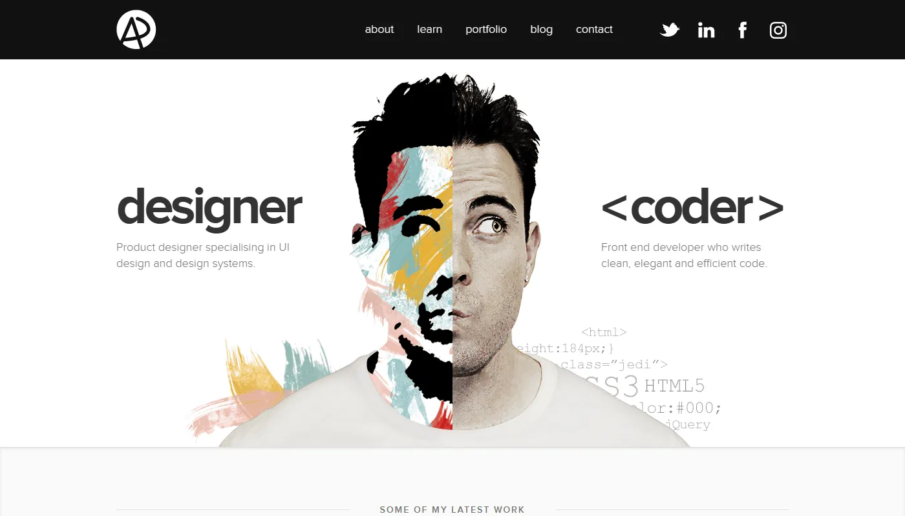
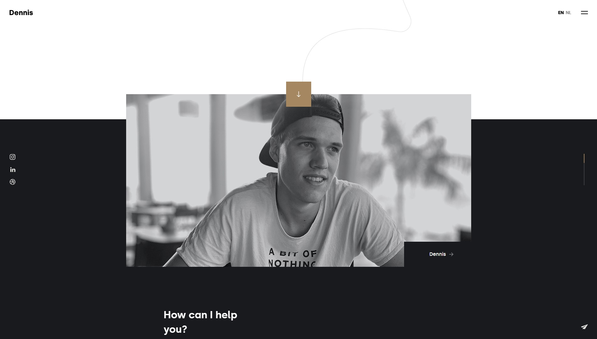
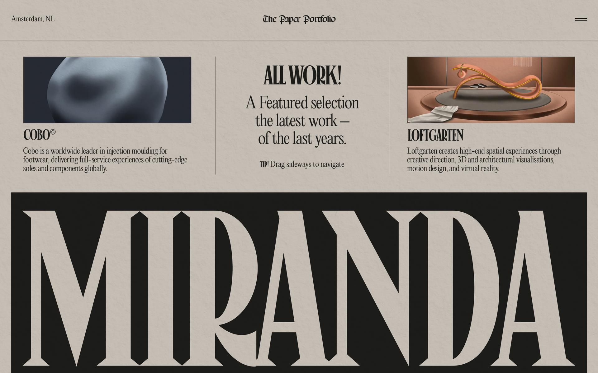
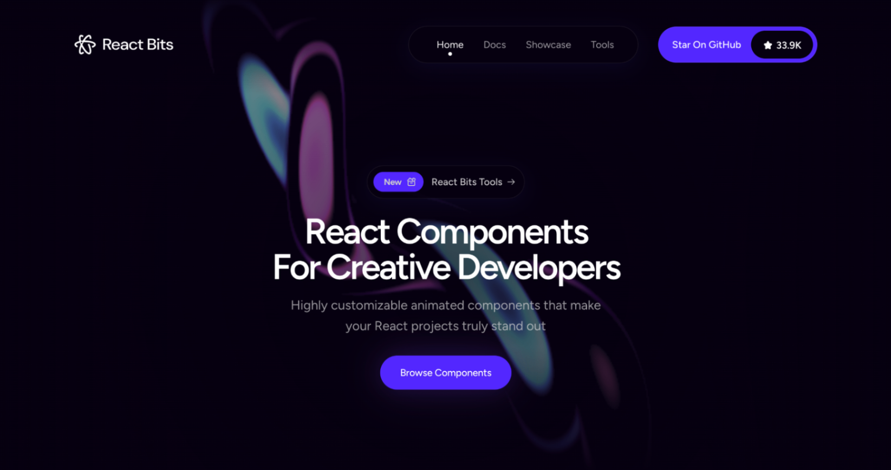
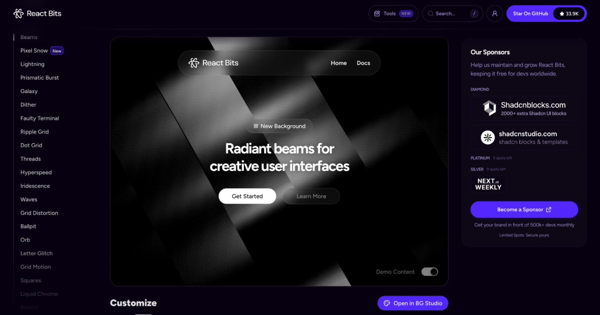

# Brand Discovery & Portfolio Direction — Mohamed Ramy

> مرحلة البحث والاستراتيجية فقط — لا يتضمن هذا الملف تنفيذ الموقع أو كتابة كود.

## 1) الخلاصة التنفيذية

الاتجاه الأقوى لمحمد رامي ليس تقديمه كـ "Frontend Developer" منفصل عن "UI/UX Designer"، بل كشخص يجمع بين الاثنين ويحوّل منطق المنتج المعقد إلى واجهات واضحة وقابلة للشحن.

### التموضع المقترح

**Product-minded Frontend Developer & UI/UX Designer**

**وعد البراند:**

> I turn complex product logic into clear, production-ready interfaces.

**العبارة المميزة المقترحة:**

> Logic, made visible.

هذا التموضع مدعوم فعلياً بالمشاريع والخبرة:

- Nizam يثبت فهم منطق ERP والمحاسبة، وليس مجرد رسم Dashboard.
- Khwarizmi Metrics يثبت التعامل مع البيانات والـAPIs والـreport builder.
- vbooking يثبت بناء تدفقات تشغيل وحجز ديناميكية.
- JeelTech يثبت منتجات عربية/RTL وتجربة تعليمية واسعة.
- Snap Action يثبت القدرة على تنفيذ الحركة والأداء البصري.
- خبرة Sharakat تثبت تصميم الأنظمة والمكونات قبل التنفيذ.

## 2) المواد التي تمت مراجعتها

- السيرة الذاتية كاملة بصرياً ونصياً: صفحتان.
- الصورة الشخصية الأصلية وألوان الملابس والخلفية والقص الحالي.
- تفاصيل المشاريع الموجودة في المهمة المرجعية `019f5014-2f28-76f3-ae19-f195496eec03`.
- صور ومواد Nizam وKhwarizmi وvbooking وJeelTech وSnap Action وRADX وTravelio وCulin وi-Fish وBookYourVibes.
- أمثلة بورتفوليو حقيقية: Adham Dannaway وDennis Snellenberg وNiccolò Miranda.
- React Bits الحالي ومكوناته وأدوات Background Studio وTexture Lab.
- إرشادات عرض الـcase studies، ووضوح المحتوى، والتباين وإتاحة الحركة.

## 3) تشخيص البراند الحالي

### نقاط القوة الحقيقية

1. **Bridge بين التصميم والهندسة**: تبدأ من Figma وتفهم ما يحدث بعده في الكود والـAPI والـQA.
2. **قدرة على التعامل مع التعقيد**: ERP، تقارير، بيانات، حجوزات، نماذج ديناميكية، RTL.
3. **Product thinking**: تفهم الهدف التجاري وتبني المكونات والتدفقات حوله.
4. **اتساع بصري بدون الانحصار في SaaS تقليدي**: Snap Action وCulin يثبتان الحس البصري والحركة.
5. **ملاءمة لسوقين**: فرق المنتجات والـstartups من جهة، والوكالات والعملاء المباشرين من جهة أخرى.

### المشكلة الحالية لو عُرضت الخبرة كما هي

- قائمة الأدوات كبيرة وقد تجعل الزائر يراك "generalist" بدون نقطة تميز.
- المشاريع كثيرة ومختلفة؛ عرضها بنفس الوزن سيضعف المشاريع الأقوى.
- عبارة "Frontend Developer & UI/UX Designer" تصف وظيفتين لكنها لا تشرح القيمة الناتجة من اجتماعهما.
- الشكل الأخضر وحده لا يصنع هوية؛ يجب أن يرتبط الأخضر بفكرة ونظام بصري متكرر.

### الحل

الهوية تبنى حول فكرة: **من التعقيد إلى الوضوح**.

اللغة البصرية تجمع بين:

- Grid دقيق يمثل المنطق، المكونات، والأنظمة.
- خط/مسار عضوي يمثل رحلة الفكرة من Sketch إلى Product.
- صور منتجات حقيقية تثبت التنفيذ.
- حضور إنساني واضح لصورة محمد حتى لا يتحول الموقع إلى معرض UI بارد.

## 4) الجمهور والهدف

### الجمهور الأساسي

1. Product founders وstartup teams يحتاجون شخصاً يملك الواجهة من الفكرة للشحن.
2. Product managers وengineering managers يبحثون عن Frontend يفهم المنتج والتصميم.
3. Digital agencies تحتاج شخصاً ينفذ Figma بجودة ويتعامل مع الحركة والاستجابة.
4. Recruiters لوظائف Frontend / Product UI / Design Engineer.

### ما يجب أن يعرفه الزائر خلال أول 10 ثوانٍ

- من هو محمد؟
- ما المشكلة التي يحلها؟
- ما نوع المنتجات التي بناها؟
- هل شغله حقيقي وقابل للفتح كـcase study؟
- ما الخطوة التالية للتواصل؟

### الهدف التحويلي

ليس الهدف "إبهار" الزائر فقط. الهدف أن يفتح مشروعاً واحداً على الأقل ثم يتواصل، أو يحمل الـCV، أو ينتقل إلى LinkedIn/GitHub.

## 5) جوهر الهوية اللفظية

### Brand essence

**Clear systems. Human interfaces. Shippable products.**

### Brand pillars

| المحور | المعنى | الدليل |
|---|---|---|
| Product clarity | تبسيط منطق معقد بدون تسطيحه | Nizam، Khwarizmi |
| End-to-end ownership | من المتطلبات وFigma إلى QA والإطلاق | Multi Marketer، Sharakat |
| Design-engineering bridge | القرار البصري قابل للتنفيذ والصيانة | Design systems + React/Next.js |
| Motion with purpose | الحركة تخدم الفهم والهوية لا الاستعراض | Snap Action، GSAP، Three.js |

### شخصية البراند

- دقيق لكن ليس بارداً.
- واثق لكن ليس متباهياً.
- بصري لكن ليس مزخرفاً.
- تقني لكن لا يكتب للزائر كأنه README.
- إنساني ومباشر.

### كلمات نستخدمها

`clarify` — `design` — `build` — `simplify` — `connect` — `ship` — `scale`

### كلمات نتجنبها

`passionate` — `pixel-perfect` — `innovative` — `cutting-edge` — `creative developer` بدون دليل — قوائم الأدوات الطويلة داخل الـhero.

## 6) محتوى الـHero المقترح

### الاختيار الأول — الموصى به

**Eyebrow**

`Frontend Developer × UI/UX Designer`

**Headline**

`I turn complex products into clear, shippable interfaces.`

**Supporting copy**

`I’m Mohamed Ramy, a product-minded frontend developer and UI/UX designer building scalable React and Next.js products, data-rich dashboards, and thoughtful digital experiences.`

**Primary CTA**

`Explore selected work`

**Secondary CTA**

`Let’s build something useful`

### اختيار أقصر وأكثر براندنج

**Headline**

`Logic, made visible.`

**Supporting copy**

`From product flows and design systems to production-ready React interfaces.`

### اختيار أكثر مباشرة للتوظيف

**Headline**

`Designing the experience. Building the product.`

**Supporting copy**

`Frontend developer and UI/UX designer working across React, Next.js, TypeScript, Figma, and complex product workflows.`

### التوصية

استخدام الاختيار الأول كـH1، و`Logic, made visible.` كعبارة مميزة تظهر في الـlogo lockup أو الفاصل بين الأقسام.

## 7) الاتجاه البصري المقترح

### اسم الاتجاه

**Organic Systems / Living Interface**

### الفكرة

نظام بصري هندسي دقيق تتخلله حركة عضوية واحدة. هذا يعكس الجمع بين component architecture وبين الحس الإنساني والتصميمي.

### أسلوب الصفحة

- خلفية رئيسية near-black وليست أسود صافياً.
- مساحات warm ivory داخل بعض أقسام المشاريع لإظهار التباين.
- 12-column grid واضح لكن يتم كسره في لحظات محسوبة.
- مسار رفيع يتحول من Sketch غير منتظم إلى منحنى نظيف ثم Grid.
- Grain/Dither خفيف جداً يعطي ملمساً ولا يفسد وضوح الصور.
- صور المشاريع هي البطل، وليست cards صغيرة كثيرة.
- الحواف متوسطة؛ لا نستخدم pills في كل شيء.

### لوحة اللون

الألوان الأساسية مأخوذة من الصورة الشخصية، خصوصاً الجاكيت والـhoodie.

| الدور | اللون | الاستخدام |
|---|---|---|
| Deep Ink | `#0D100E` | الخلفية الرئيسية |
| Warm Ivory | `#F3F1E9` | النص ومساحات المشاريع الفاتحة |
| Photo Olive | `#696C56` | لون ثانوي مشتق من الصورة |
| Soft Sage | `#9CA39B` | حدود ومساحات هادئة |
| Signal Lime | `#B8F36A` | CTA، focus، نقطة الحركة المميزة |
| Muted Stone | `#282824` | الأسطح والـcards الداكنة |

ملحوظة: `Signal Lime` يستخدم بنسبة صغيرة؛ لو غطى الصفحة سيتحول الشكل إلى gaming/cyberpunk.

نسبة التباين بين Warm Ivory وDeep Ink تقارب `16.9:1`، وبين Signal Lime وDeep Ink تقارب `14.6:1`. النص العادي يجب أن يحقق 4.5:1 على الأقل وفق WCAG AA.

### اتجاه الخطوط

**الموصى به:**

- Display: `Bricolage Grotesque` أو `Syne` للعناوين القصيرة.
- Body/UI: `Manrope` أو `Plus Jakarta Sans` للنصوص والواجهات.
- Editorial accent محدود: `Instrument Serif` لعبارة أو رقم كبير، وليس لكل العناوين.
- Arabic companion عند الحاجة: `IBM Plex Sans Arabic` أو `Alexandria`.

الاختيار النهائي يجب اختباره على كلمات الاسم، العناوين الإنجليزية، ولقطات RTL قبل اعتماده.

## 8) معالجة الصورة الشخصية

الصورة الأصلية ودودة ومناسبة، لكن القص الأبيض والـdrop shadow الحاليان يبدوان أقرب لصورة CV قديمة من key visual لبراند معاصر.

### المعالجة المقترحة

- الاحتفاظ بالابتسامة والوضعية والجاكيت لأنها تدعم الهوية الخضراء طبيعياً.
- إزالة الظل القاسي والحواف البيضاء.
- إضاءة أنعم ودمج الشخص داخل الخلفية بدلاً من وضعه فوقها.
- وضع الصورة في الثلث الأيمن، وترك negative space للنص في اليسار.
- استخدام Grid ومسار رفيع خلف الصورة بدون floating UI cards.

### Key visual تجريبي

هذا مرجع اتجاه، وليس النسخة النهائية. الوجه محفوظ جيداً والفكرة البصرية صحيحة، لكن النسخة النهائية قد تحتاج قصاً أدق وتفاصيل أقل خلف الرأس.

## 9) اتجاهات اللوجو

### A. Route Monogram — الموصى به

خط واحد يبدأ كـ`M` وينتهي كـ`R`، مع انتقال من curve عضوي إلى زاوية هندسية.

**يرمز إلى:** من الفكرة إلى النظام، ومن التصميم إلى التنفيذ.

**الاستخدام:** favicon، cursor mark، project stamp، social avatar.

### B. Modular MR

حرفا `M` و`R` داخل شبكة 3×3، مع مربع واحد بلون Signal Lime.

**الميزة:** تقني وقابل للحركة.

**الخطر:** قد يبدو كشعار SaaS إذا فقد الشخصية.

### C. Ramy Wordmark

كلمة `RAMY` بهيكل typographic مخصص، مع تعديل ساق حرف R لتصبح مساراً مستمراً.

**الميزة:** الاسم أسهل في التذكر من monogram وحده.

### التوصية

نستخدم Wordmark `MOHAMED RAMY` في الـheader، وRoute Monogram كعلامة مختصرة. لا نستخدم أقواس الكود `</>` لأنها مستهلكة ولا تعكس جانب المنتج والتصميم.

## 10) تحليل مراجع الإلهام

### Adham Dannaway

**نأخذ:** وضوح فكرة الشخص الذي يجمع التصميم والكود من أول شاشة.

**لا نأخذ:** تقسيم الوجه حرفياً؛ الفكرة مرتبطة به وأصبحت معروفة جداً. عند محمد نترجم الازدواج إلى "مسار يتحول إلى نظام".

الموقع: https://www.adhamdannaway.com/

### Dennis Snellenberg

**نأخذ:** الثقة في المساحات، حضور الصورة الشخصية، والـart direction الهادئ.

**لا نأخذ:** كثرة الفراغ قبل القيمة الأساسية أو إخفاء المشاريع خلف تجربة طويلة.

الموقع: https://dennissnellenberg.com/

### Niccolò Miranda

**نأخذ:** استخدام Typography كعنصر معماري، ملمس الورق، والـproject-first storytelling.

**لا نأخذ:** الكثافة الصحفية القصوى أو الخطوط الصعبة في body copy؛ محمد يحتاج وضوحاً أقرب لمنتجات SaaS.

الموقع: https://www.niccolomiranda.com/

### React Bits

**نأخذ:** جودة بعض المكونات، سهولة تخصيصها، والوصول إلى Background Studio وTexture Lab.

**لا نأخذ:** الـpurple glow واللغة البصرية الافتراضية، ولا نحول الموقع إلى معرض React Bits.

المصدر: https://github.com/DavidHDev/react-bits

## 11) استراتيجية اختيار المشاريع

### المشاريع الرئيسية — Case Studies كاملة

#### 1. Nizam Accounting — Flagship

**القصة:** كيف تم جمع دورة مالية وتشغيلية معقدة داخل تجربة عربية واضحة وقابلة للتوسع.

**يثبت:** ERP، RTL، business logic، design system، dark/light، APIs، ownership.

#### 2. Khwarizmi Metrics

**القصة:** تحويل مصادر تسويقية متعددة إلى workflow موحد لبناء التقارير والـvisualizations.

**يثبت:** Data product، report builder، integrations، reusable UI، complex states.

#### 3. Snap Action

**القصة:** تجربة brand-first سريعة وغنية بالحركة بدون التضحية بالأداء.

**يثبت:** GSAP، Three.js، responsive motion، 60fps mindset، landing page craft.

#### 4. JeelTech

**القصة:** بنية LMS عربية متعددة الصفحات تجمع التعلم والمكتبة والمساعد الذكي والتقارير.

**يثبت:** RTL، education، dashboards، modular architecture، AI-facing UX.

### المشاريع الثانوية — Project Reel / Archive

- vbooking: booking operations and dynamic package flows.
- BookYourVibes: yacht booking and client-facing travel experience.
- RADX: hospitality concierge and AR guide landing experience.
- Travelio: DMC landing and marketing experience.
- Culin: experimental visual motion.
- i-Fish: specialized operations/dashboard product.

لا نعرض كل مشروع بنفس الحجم. المشاريع الثانوية تظهر كـreel سريع أو tiles صغيرة، وكل واحدة تؤدي وظيفة إثبات محددة.

## 12) بنية الموقع المقترحة — بدون تنفيذ

### الصفحة الرئيسية

1. **Header**: wordmark، Work، About، Resume، Contact.
2. **Hero**: التموضع، CTA، الصورة الشخصية، signature path.
3. **Proof strip**: React / Next.js / TypeScript / Figma، مع موقع العمل وحالة التوفر.
4. **Selected work**: أربع case studies بترتيب واضح.
5. **What I bridge**: Product logic → UX system → Frontend architecture → Release.
6. **Capabilities**: Product UI، Frontend systems، Data-rich dashboards، Motion.
7. **Experience timeline**: مختصر، لا يكرر الـCV.
8. **Experiments / Selected archive**: المشاريع الثانوية والحركة.
9. **About**: فقرة شخصية قصيرة وصورة.
10. **Final CTA**: رسالة واضحة + Email/LinkedIn.
11. **Footer**: الموقع، التوقيت المحلي، CV، GitHub، LinkedIn.

### ما لا نضعه في الصفحة الرئيسية

- كل skills الموجودة في الـCV.
- progress bars للمهارات.
- testimonial مزيف أو أرقام غير موثقة.
- timeline طويل لكل وظيفة.
- carousel يجبر الزائر على الانتظار.
- preloader طويل لمجرد الاستعراض.

## 13) هيكل كل Case Study

1. Outcome-first cover: المنتج والنتيجة في سطر واحد.
2. Context: المنتج والسوق والمشكلة.
3. Role / Team / Timeline / Stack بوضوح.
4. Constraints الحقيقية.
5. System map أو product architecture.
6. 2–3 قرارات UX/Engineering حقيقية.
7. تدفق رئيسي واحد أو اثنان، لا كل الشاشات.
8. Final interface + motion.
9. Engineering notes: components، state، API، responsive/RTL.
10. Outcome: أرقام موثقة فقط، وإلا نستخدم نتيجة نوعية صادقة.
11. Reflection: ما الذي تعلمته وما الذي ستغيره.

إرشادات مراجعة الـUX portfolios تؤكد أن الـcase study يجب أن تعرض السياق، العملية، القرارات، والنتيجة بدلاً من gallery شاشات فقط. كما أن القارئ غالباً يمسح المحتوى بسرعة؛ لذلك نعرض النتيجة مبكراً ثم نتيح التفاصيل لمن يريد.

مصادر:

- https://careerfoundry.com/en/blog/ux-design/ux-portfolio-examples-inspiration/
- https://media.nngroup.com/media/reports/free/UserExperienceCareers_2nd_Edition.pdf

## 14) خطة React Bits

React Bits حالياً يحتوي على أكثر من 140 مكوناً/تأثيراً قابلاً للتخصيص. كثرة الاستخدام ستجعل البراند يبدو كـcomponent demo، لذلك الاستخدام المقترح محدود.

| الموضع | المكون | القرار |
|---|---|---|
| Hero background | `Threads` أو `Soft Aurora` | نختبر واحداً فقط بألوان الزيتوني والليم، وبكثافة منخفضة |
| Hero headline | `Blur Text` أو `Split Text` | دخول أول مرة فقط، بدون إعادة مستمرة |
| Experiments archive | `Chroma Grid` أو `Magic Bento` | مناسب للمشاريع الثانوية، مع إعادة تصميم كاملة للـcards |
| Capability labels | `Variable Proximity` | اختياري على desktop فقط |
| Small interaction | `Magnet` | للـCTA الرئيسي فقط إن لم يضر التحكم |

### React Bits لا نستخدمه هنا

- `Decrypted Text` في الاسم؛ cliché تقني ويقلل النبرة الإنسانية.
- `Hyperspeed` أو `Lightning` كخلفية رئيسية؛ ستدفع الشكل نحو gaming.
- `Logo Loop` لقائمة التقنيات؛ شائع ولا يضيف دليلاً.
- مؤثرات cursor كثيرة؛ تضر الاستخدام والموبايل.

## 15) خطة GSAP

### Intro timeline

- wordmark يظهر أولاً.
- سطر الـeyebrow ثم كلمات الـheadline بإيقاع قصير.
- الصورة تدخل مع تحريك بسيط جداً.
- signature path يتم رسمه من Sketch إلى Grid.
- CTA يظهر أخيراً.

المدة المستهدفة: `1.0–1.3s`، بدون preloader طويل.

### ScrollTrigger

- رسم المسار مع تقدم المستخدم في أول قسمين.
- project covers تكشف نفسها باستخدام transform/clip بصري محسوب.
- قسم Selected Work يمكن أن يكون sticky على desktop مع انتقال الصور، لكنه يتحول لقائمة طبيعية على mobile.
- داخل case studies: تثبيت device frame في موضع واحد بينما تتغير خطوات التدفق بجانبه.

### Micro-interactions

- `quickTo()` لحركة cursor/hover محسوبة على desktop.
- project image يتحرك 2–3% فقط عند hover.
- CTA magnet خفيف، مع focus واضح للكيبورد.

### قواعد الأداء والإتاحة

- تحريك `transform` و`opacity` أساساً.
- `useGSAP()` داخل React مع scope وتنظيف تلقائي.
- `gsap.matchMedia()` للـbreakpoints و`prefers-reduced-motion`.
- لا نربط كل قسم بـScrollTrigger.
- لا نستخدم scrub وtoggleActions على نفس الـtrigger.
- لا نستخدم smooth scrolling إلا إذا أثبت الاختبار أنه مفيد.
- النسخة reduced-motion تظل كاملة وقابلة للفهم بدون حركة.

## 16) نظام الحركة المقترح

| النوع | المدة | الإحساس |
|---|---:|---|
| Page intro | 1000–1300ms | confident, composed |
| Section reveal | 500–700ms | clear, not theatrical |
| Hover | 180–260ms | immediate |
| Scroll scrub | 0.6–1s catch-up | fluid but controlled |

كل حركة يجب أن تحقق واحداً من الآتي: توجيه الانتباه، شرح العلاقة، أو دعم الهوية. غير ذلك تُحذف.

## 17) الإتاحة والأداء كجزء من البراند

- النص العادي يحقق contrast 4.5:1 على الأقل، والكبير 3:1 وفق WCAG.
- أزرار وروابط لها focus واضح، وليس hover فقط.
- الصور لها alt text يشرح الوظيفة لا الشكل.
- animation controls/reduced motion حقيقية.
- Project screenshots محسنة WebP/AVIF ولا تُحمّل كلها في أول شاشة.
- Hero visual لا يمنع قراءة النص إذا فشل WebGL أو JavaScript.

المصدر: https://www.w3.org/WAI/WCAG20/Understanding/contrast-minimum

## 18) قرار اللغة

### التوصية

English-first لأن الجمهور الأساسي عالمي، مع إبراز خبرة RTL داخل المشاريع.

خيار لاحق: Arabic summary للصفحة الرئيسية، وليس ترجمة كاملة لكل case study منذ أول نسخة. الترجمة الكاملة ستضاعف عبء المحتوى والصيانة قبل أن نعرف أنها مطلوبة.

## 19) الـSkills التي تمت مراجعتها

### Skills مستخدمة في مرحلة البحث

- PDF: مراجعة الـCV بصرياً ونصياً.
- Browser: البحث في المواقع الحقيقية ومصادر الإلهام.
- Landing Page Guide: تثبيت اتجاه بصري واضح وتجنب الشكل العام المتكرر.
- Image Generation: إنشاء key visual تجريبي من الصورة الشخصية.
- GSAP Core / React / Timeline / ScrollTrigger / Performance: تحويل الرؤية إلى motion plan قابل للتنفيذ لاحقاً.
- Find Skills: البحث عن Skills إضافية بدل الافتراض.

### Skill إضافية تم العثور عليها

`interactive-portfolio` من `sickn33/antigravity-awesome-skills` لديه أكثر من 1.2K installs، والمستودع المصدر معروف وواسع الانتشار. تركيزه أقرب إلى مرحلة تنفيذ بورتفوليو تفاعلي وفحص anti-patterns.

الرابط: https://skills.sh/sickn33/antigravity-awesome-skills/interactive-portfolio

### القرار

لا نحتاج تثبيته الآن لأن المرحلة الحالية بحث وتموضع، والـSkills المثبتة تغطي هذه المرحلة بالفعل. يمكن تثبيته عند بدء مرحلة التنفيذ والمراجعة إذا وافق محمد.

تم استبعاد ترشيحات personal-brand الأقل انتشاراً حالياً لأنها دون عتبة الثقة المطلوبة، ولأن محتواها لم يضف قيمة واضحة فوق البحث الحالي.

## 20) ما يجب تثبيته قبل الدخول إلى التصميم النهائي

1. اعتماد جملة التموضع النهائية.
2. اعتماد اتجاه Organic Systems أو طلب بديل بصري.
3. اختيار 4 مشاريع رئيسية.
4. توثيق الدور الحقيقي في كل مشروع: design، frontend، أم الاثنين.
5. توثيق الفريق والمدة والقيود والنتائج الحقيقية.
6. اختيار اتجاه اللوجو: Route Monogram أم Wordmark.
7. قرار English-only أم English-first مع Arabic summary.

## 21) التوصية النهائية للمرحلة التالية

قبل كتابة أي كود، تكون الخطوة التالية واحدة من اثنتين:

1. **Brand board v1:** تثبيت اللوجو، الخطوط، الألوان، الـgrid، ونظام الصورة والحركة في لوحة واحدة.
2. **Content workshop:** كتابة Home copy وملخصات المشاريع الأربع وجمع المعلومات الناقصة لكل case study.

الترتيب الموصى به: Content workshop أولاً، ثم Brand board، ثم wireframe، وبعد اعتمادهم يبدأ Next.js.

